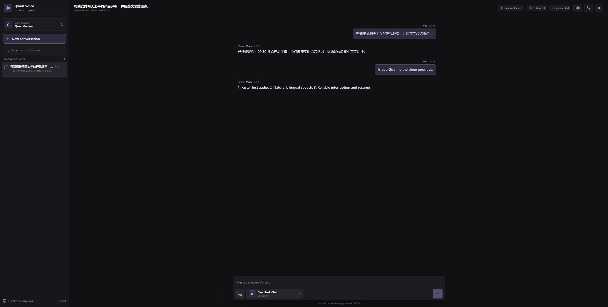

# LivePhoneCall

Local-first Chinese/English voice conversations powered by streaming Qwen3 ASR
and TTS, pluggable language models, and an installable Vue PWA.

[](LICENSE)
[](pyproject.toml)
[](frontend/package.json)
[](compose.yaml)



## Highlights

- Live, non-recording phone-style conversations with interruption controls.
- Streaming Qwen3-ASR transcription and sentence-level Qwen3-TTS PCM playback.
- Chinese, English, and mixed-language conversations in the same workspace.
- OpenAI, Anthropic, Gemini, DeepSeek, DashScope, Ollama, and custom compatible providers.
- Per-agent instructions, provider, model, language, and reply voice settings.
- Local SQLite conversation history; microphone audio is never persisted.
- Responsive installable PWA plus a reproducible Windows/WSL2 Docker deployment.

## Architecture

```text
Browser / mobile PWA
        |
        v
FastAPI :8002  --->  SQLite conversations
   |       |
   |       +------->  pluggable LLM provider (SSE)
   |
   +--------------->  isolated model worker :8003
                          |              |
                          v              v
                    Qwen3-ASR       Qwen3-TTS :8001
```

## How it works

ASR and TTS use isolated model environments because their upstream packages pin
incompatible `transformers` patch versions. FastAPI on `localhost:8002` is the
only backend interface used by the Vue app; ports `8001` and `8003` are internal
model adapters and must not be called by frontend code.

Backend modules live in `backend/modules/`: `chat` owns SQLite conversations,
`voice` owns streaming ASR, `agent` owns model SSE, and `tts` owns streaming PCM.
The worker adapter hides process isolation behind one FastAPI interface.

The start script limits ASR to a 16K context so both models fit concurrently in
the tested 16GB GPU. Increasing this value can prevent vLLM from allocating its
KV cache while TTS is resident.

## Windows Docker deployment

The repository includes one production image that builds the Vue PWA, the
FastAPI application, and isolated ASR/TTS runtimes. Only port 8000 is exposed;
ports 8001 and 8003 stay inside the container. Model weights are mounted
read-only from `models/` so rebuilding or exporting the runtime image does not
duplicate several gigabytes of weights. SQLite data is persisted in `data/`.

Requirements on the destination Windows PC are Docker Desktop using the WSL2
engine, a current NVIDIA Windows driver, and at least 16 GB of GPU memory for the
default settings. Copy this project together with its `models/` directory, then
run from PowerShell:

```powershell
powershell -ExecutionPolicy Bypass -File scripts/deploy_docker_windows.ps1
docker compose logs -f app
```

The script checks Docker, GPU passthrough, and both model directories before it
builds. Runtime settings live in `.env`; the first run creates it from
`.env.docker.example`. Stop or update the deployment with:

```powershell
docker compose down
docker compose up --build --detach
```

For phone microphone access and PWA installation, put a LAN-trusted certificate
at `.cert/lan-cert.pem` and `.cert/lan-key.pem`, then set these values in `.env`:

```dotenv
QWEN_VOICE_PORT=8443
TLS_CERT_FILE=/certs/lan-cert.pem
TLS_KEY_FILE=/certs/lan-key.pem
```

Open `https://<PC-LAN-IP>:8443` after trusting the issuing CA on the phone. Plain
HTTP remains useful on the Windows host, but mobile browsers will not grant it
microphone or PWA installation privileges over a LAN address.

## Web PWA

The Vue client is an installable PWA on Chromium, Android, and iOS/iPadOS. Its
manifest includes regular, maskable, and Apple touch icons. The generated
service worker precaches only the frontend application shell and static assets;
API calls, microphone chunks, model streams, and TTS audio are never cached.
When a new frontend version is available, the UI asks before reloading so an
active phone call is not interrupted. The interface can open offline, while AI,
chat synchronization, ASR, and TTS correctly remain dependent on the local
FastAPI service.

## Install

From PowerShell, sync the Linux ASR/LangChain environment and isolated TTS environment:

```powershell
wsl bash -lc 'cd /mnt/d/1AProject/demo_list/ai/tts && UV_PROJECT_ENVIRONMENT=.venv-wsl uv sync --locked'
wsl bash -lc 'cd /mnt/d/1AProject/demo_list/ai/tts/qwen3-tts-service && uv sync'
```

Do not run the root `uv sync` on native Windows: vLLM currently requires Linux.
The installed Windows CUDA driver is shared with WSL, so inference still runs on
the same NVIDIA GPU.

Download Qwen3-TTS from ModelScope:

```powershell
wsl bash -lc 'cd /mnt/d/1AProject/demo_list/ai/tts && uv run --project qwen3-tts-service qwen3-tts-service/download_model.py'
```

## Model providers

Open `http://127.0.0.1:8000/settings` to configure and test providers without
restarting the service. The built-in catalog includes OpenAI, Anthropic, Google
Gemini, Alibaba DashScope, DeepSeek, Moonshot AI, OpenRouter, SiliconFlow, and
Ollama. Custom OpenAI-compatible endpoints such as vLLM and LM Studio can be
added from the same page.

The settings page and its mutation/test APIs accept localhost requests only.
They are intentionally unavailable through LAN addresses and the mobile HTTPS
tunnel so a remote client cannot redirect requests carrying a stored API key.

The design follows pi's separation of model configuration and authentication:
provider/model settings are saved in `.voice-agent/models.json`, while API keys
are saved separately in `.voice-agent/auth.json` and are never returned by the
settings API. Both files are ignored by Git. A blank key field preserves the
stored key.

### Environment fallback

Without configuration, the page uses an explicit echo response so ASR and TTS
can be tested without an API key. The included provider is `langchain-openai`;
configure an OpenAI or OpenAI-compatible model before starting:

```text
VOICE_AGENT_MODEL=openai:gpt-4.1-mini
VOICE_AGENT_API_KEY=your-key
```

An OpenAI-compatible Qwen endpoint can also use `VOICE_AGENT_BASE_URL` and a
model such as `VOICE_AGENT_MODEL=openai:qwen-plus`. Optional settings are
`VOICE_AGENT_SYSTEM_PROMPT`, `VOICE_AGENT_TEMPERATURE`, `VOICE_AGENT_TIMEOUT`,
and `VOICE_AGENT_MAX_TOKENS`. Install the matching LangChain integration package
before selecting a different provider.

Environment variables remain a backward-compatible fallback until the settings
page saves its first provider configuration. After that, the active provider in
the settings page takes precedence.

## Start

```powershell
wsl bash -lc 'cd /mnt/d/1AProject/demo_list/ai/tts && bash scripts/start_backend.sh'
cd frontend
yarn vite --host 0.0.0.0
```

FastAPI documentation is available at `http://127.0.0.1:8002/docs`. The Vue
workspace is available locally at `http://127.0.0.1:8000` and, after allowing
inbound TCP 8000 from `LocalSubnet` in Windows Firewall, at
`http://<PC-LAN-IP>:8000`. It proxies every `/api/*` request to FastAPI, so ports
8001, 8002, and 8003 should remain private to this PC.

## Vue frontend

The new chat interface lives in `frontend/` as a Vue 3 and Vite application.
It includes responsive conversation navigation, text messages, browser audio
recording with microphone selection, root-level SQLite persistence, custom Agents, and
light/dark themes. Each Agent can define its own instructions, provider, model,
language, and reply voice. Each conversation remains bound to the Agent it was
created with, and the active conversation's Agent can be changed from the
chat header at any time. The light palette uses cream and soft orange; the
dark palette uses charcoal and soft purple.

For frontend-only development, leave the AI services stopped and run:

```powershell
cd frontend
yarn
yarn dev
```

Open `http://127.0.0.1:8000`, or `http://<PC-LAN-IP>:8000` from another device on
the same network. `yarn dev` starts Vite on all network interfaces and the local-only SQLite
service together. Text, recorded audio, sessions, and Agents are stored in
`chat-data.sqlite3` at the project root, which makes backup and one-device-at-a-time
file synchronization straightforward. Do not synchronize a live SQLite database
between two running machines; stop the local service first. The database (including
Agent API keys) is ignored by Git and should be treated as sensitive local data.

Each custom Agent can set its provider, model, Base URL, API Key, and request path.
These fields are stored per Agent so separate conversations can use separate models.
The phone icon starts a live, non-recording call. Browser audio is resampled to
16 kHz and streamed directly to Qwen3-ASR; after roughly 0.9 seconds of silence
the turn is finalized, its text is sent to the selected Agent, and streamed model
text is passed sentence-by-sentence to Qwen3-TTS. SQLite stores only the resulting
user and assistant text, never microphone audio.

For Vite development, start the model stack on its development port in a second
terminal after its models are installed:

```powershell
wsl bash -lc 'cd /mnt/d/1AProject/demo_list/ai/tts && VOICE_AGENT_PORT=8003 bash scripts/start_voice_agent.sh'
```

Build and test the frontend with `yarn build` and `yarn test`. The next
integration step is to connect the Vue composer and phone workflow to the
existing `/api/*` endpoints, then serve the production bundle from Flask.

For mobile microphone testing, use a trusted HTTPS URL. Browsers do not grant
microphone access to a plain `http://<PC-LAN-IP>` origin. A Cloudflare Quick
Tunnel is the shortest test path (no account required):

```powershell
winget install --id Cloudflare.cloudflared --exact
powershell -ExecutionPolicy Bypass -File scripts/start_mobile_https.ps1
```

Open the printed `https://*.trycloudflare.com` URL on the phone. A Quick Tunnel
is public, has a random address, and has no built-in authentication, so use it
only with non-sensitive test audio and stop it with `Ctrl+C` afterward. For
display or playback without microphone access, a phone on the same Wi-Fi can
use `http://<PC-LAN-IP>:8000` after allowing inbound TCP 8000 in Windows
Firewall. `localhost` on a phone means the phone itself.

For private LAN-only HTTPS, install `mkcert`, trust its local CA, and generate a
certificate for the PC LAN address. This workspace reads `.cert/lan-cert.pem`
and `.cert/lan-key.pem` when `scripts/start_lan_https.ps1` builds the PWA and
starts the production preview on 8443.
Install `frontend/public/qwen-local-rootCA.cer` on the phone and explicitly trust
it, then open `https://<PC-LAN-IP>:8443`. Never copy the mkcert `rootCA-key.pem`
to another device.

```powershell
wsl bash -lc 'cd /mnt/d/1AProject/demo_list/ai/tts && bash scripts/stop_voice_agent.sh'
```

## API

- `GET /api/voice/health`: TTS readiness and LangChain configuration
- `POST /api/agent/chat`: `{ "text": "...", "conversation_id": "...", "history": [...] }`
- `POST /api/tts`: `{ "text": "...", "language": "Auto", "speaker": "Vivian" }`
- `GET /api/settings`: provider catalog with credential status, never key values
- `PUT /api/settings/provider`: save a provider and optionally activate it
- `POST /api/settings/test`: test the saved provider connection

`/api/tts` returns `audio/wav`. This is a turn-based browser call simulation,
not a PSTN/SIP carrier integration. The API boundary can later be reused from
Twilio, FreeSWITCH, or a mobile WebSocket gateway.
